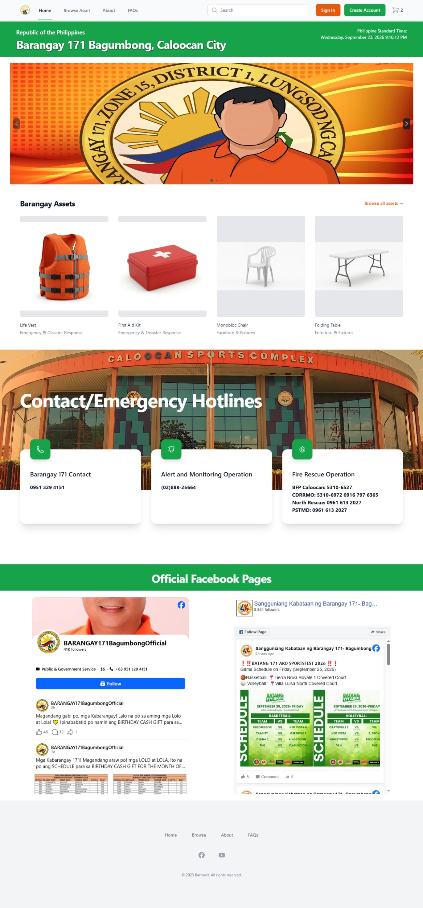
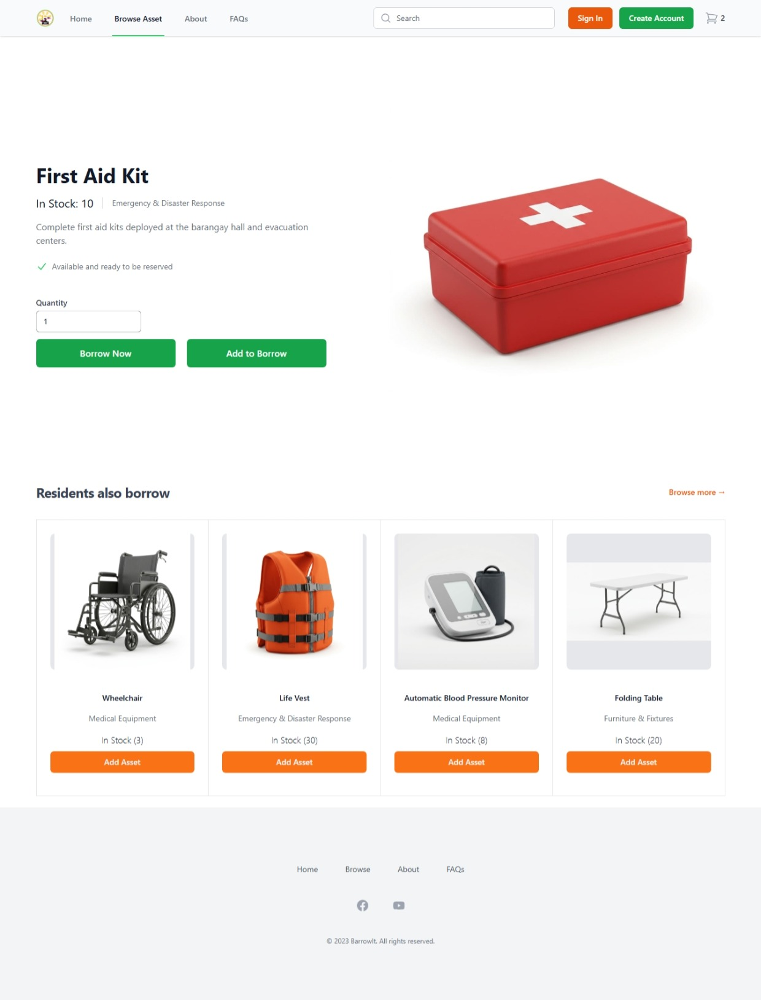
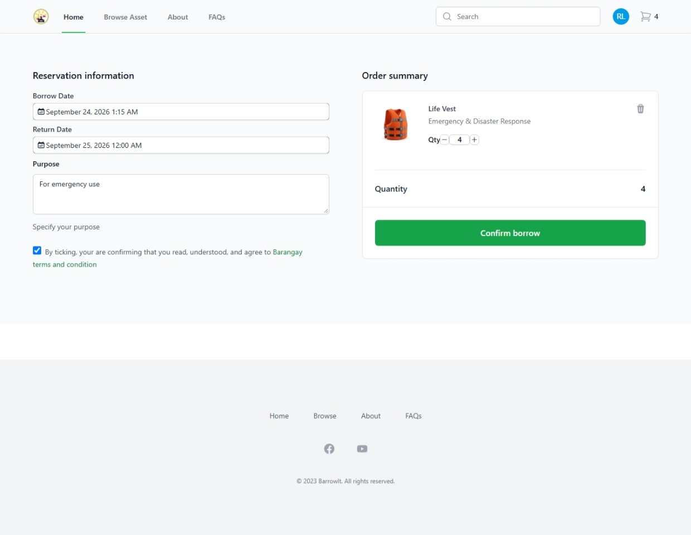
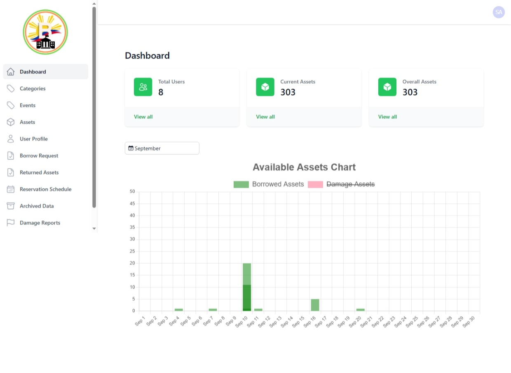
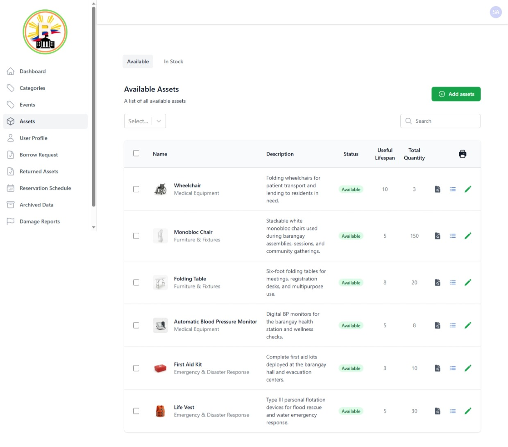
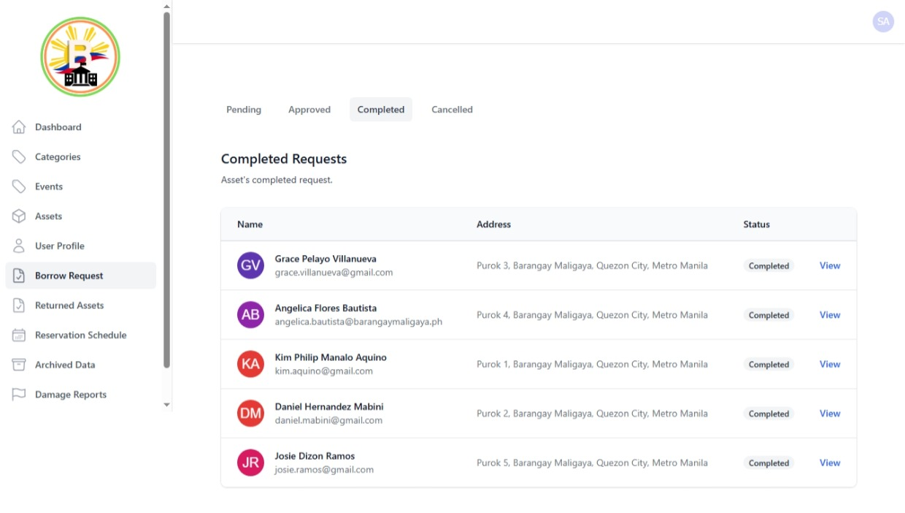

# BarrowIt

A web-based asset and equipment borrowing management system. BarrowIt lets
administrators manage assets, categories, events, and accounts, while users can
browse, reserve, and borrow assets and track their history.

## Screenshots

### User Portal

| Landing Page | Browse Assets |
| :---: | :---: |
|  |  |

| Borrow |
| :---: |
|  |

### Admin Dashboard

| Dashboard | Assets |
| :---: | :---: |
|  |  |

| Borrow Request |
| :---: |
|  |

## Features

- **Authentication** — login, registration, phone/OTP verification, and password reset
- **Dashboard** — overview statistics and charts
- **Assets** — asset inventory, stock levels, categories, and printable records
- **Borrowing** — browse, filter, reserve, and check out assets
- **Reservations** — pending, approved, completed, and cancelled workflows
- **Returned** — current loans, upcoming returns, and overdue tracking
- **Events & Schedules** — event management and a full calendar view
- **Accounts** — user and admin management with role-based permissions
- **Audit Trail & Reports** — activity logging and exportable reports
- **Archived** — restore archived accounts and assets

## Tech Stack

- [React](https://react.dev/) 18 + [Vite](https://vitejs.dev/)
- [React Router](https://reactrouter.com/) for routing
- [Zustand](https://zustand-demo.pmnd.rs/) + React Context for state
- [React Hook Form](https://react-hook-form.com/) + [Yup](https://github.com/jquense/yup) for forms and validation
- [Axios](https://axios-http.com/) for API requests
- [Tailwind CSS](https://tailwindcss.com/) + [DaisyUI](https://daisyui.com/) for styling
- [Chart.js](https://www.chartjs.org/) and [FullCalendar](https://fullcalendar.io/) for visualizations

## Getting Started

### Prerequisites

- [Node.js](https://nodejs.org/) 18 or later
- npm

### Installation

```bash
npm install
```

Create a `.env` file in the project root (see `.env.example`):

```env
VITE_BASE_URL=http://localhost:3000
```

### Development

```bash
npm run dev
```

### Build

```bash
npm run build
```

### Preview production build

```bash
npm run preview
```

### Lint

```bash
npm run lint
```

## Project Structure

```
src/
├── api/            Shared API helpers
├── components/     Reusable UI components
├── context/        React context providers
├── data/           Static data and role definitions
├── features/       Feature modules (accounts, assets, auth, ...)
├── hooks/          Custom React hooks
├── libs/           Library configuration
├── providers/      App-level providers
├── routes/         Route definitions
└── utils/          Utility functions
```

Each feature follows a consistent layout with `api`, `components`, `data`,
`routes`, and `validations` folders.

## License

Released under the [MIT License](LICENSE).
